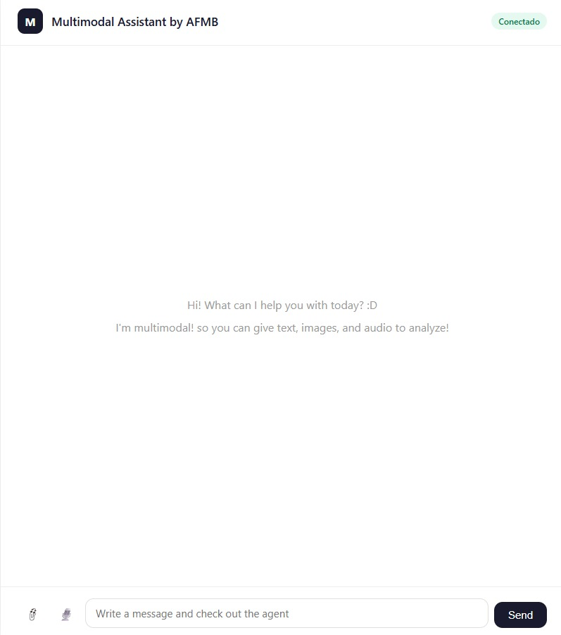
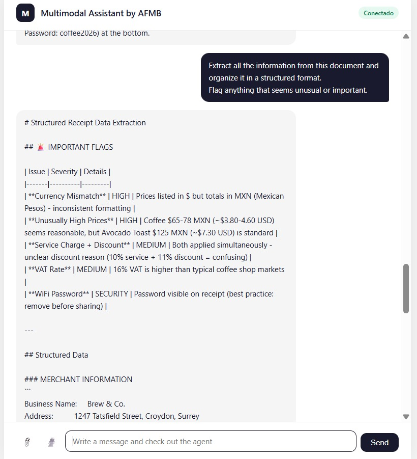

# multimodal-ai-assistant

**MULTIMODAL AI-ASSISTANT**

Production-ready conversational AI assistant with real-time streaming, vision analysis, and audio transcription — built with FastAPI and Anthropic's Claude (Claude Haiku).




This consists of a full-stack AI assistant that goes beyond only basic chat (just text). Users can send text, upload images for visual analysis, and submit audio files for a transcription and analysis of content — all processed by Claude (Haiku) in real time through a persistent WebSocket connection (full-duplex).

*Key technical decisions*:
    - WebSocket over REST for chat: This enables true token-by-token streaming
    - Single model for all modalities (Text, video, audio): Claude (claude-haiku-4-5-20251001) 
    - Stateless backend with in-memory history on the client: Alowys to scale horizontally without session storage 

---

## Features

    - Live streaming*: Responses appear token-by-token via WebSocket, not all at once

    - Vision analysis*: The user can upload any valid image file (JPG, PNG, WebP, GIF) and ask about it

    - Audio transcription*: Valid audio files can be uploaded for transcription to obtain an intelligent response or analysis of the information contained on the recording

    - Conversation memory*: Full chat history is sent with every request so Claude remembers context

    - Auto-documentation*: FastAPI generates interactive API documentation (Can be visualized at \docs)

    - Cloud deploy ready*: The assisant is ready to be deployed using Docker with the command *docker compose up*
    

Sample test chat that demonstrate the memory use and contextualized responses (Img below)
    

---

## Technology stack
| Layer | Technology | Justification |
|:-----------|:-----------:|-------------------------------------:|
| Backend    |   Uvicorn + FastAPI    |   Async-native, WebSocket support, auto OpenAPI docs   |
| AI Model   |   Anthropic Claude     |   Multimodal, context and streaming                    |
| Frontend   |   Vanilla JS + CSS     |   Fast load and easy to tailor to further requirments  |
| Container  |   Docker + Compose     |   Reproducible environments, ready to be cloud deployed|
| Testing    |   Pytest + asyncio     |   Used for Async test support for WebSocket endpoints  |

---

## Diagram


## Project folder structure 

```bash
multimodal-ai-assistant/
├── api/
│   └── routes/
│       ├── chat.py          # WebSocket endpoint for streaming the chat
│       ├── images.py        # REST endpoint for the image analysis
│       └── audio.py         # REST endpoint for the audio transcription
├── websocket_server/
│   └── manager.py           # The multi-user connection manager 
├── image_pipeline/
│   └── processor.py         # Base64 encoding and message builder for vision 
├── text_pipeline/
│   └── processor.py         # Anthropic client and streaming logic 
├── audio_pipeline/
│   └── processor.py         # Audio encoding for Claude (haiku) 
├── embeddings/
│   └── store.py             # Semantic search, yet to be extended 
├── frontend/
│   ├── index.html           # Chat UI, simple but easy to tailor to detailed specifications
│   ├── style.css            # Design the system and format
│   └── app.js               # WebSocket client, history management
├── tests/
│   └── test_chat.py         
├── docker/
│   └── Dockerfile           # Docker configuration to get the assistant ready for Cloud deployment 
├── docker-compose.yml
├── main.py                  # App entry point
└── requirements.txt
└── sample_images.txt        # Results obtained with test chat

```
 ---

## Implementation 

### Prerequisites
- Python 3.12+
- A real Anthropic Claude API key 
- Docker (fully optional, only for containerized deploy)

### Local setup 
1)  Clone this repository to start with the implementation

``` 
git clone https://github.com/ay1309/multimodal-ai-assistant.git
cd multimodal-ai-assistant

```
2) Create and initialize (activite) the virtual environment
``` 
python -m venv venv
source venv/bin/activate      # if you're working in Mac/Linux
venv\Scripts\activate         # for Windows
``` 

3) Install dependencies (requirements.txt)
``` 
pip install -r requirements.txt
``` 

4) Set up the environment variables (.env) 
``` 
cp .env.example .env
``` 
In this step, replace the placeholder with your real Anthropic Claude API key. 

5) Run and update the server
``` 
uvicorn main:app --reload --port 8000
``` 
Whenever the server gets modified, run this command to update it.

Open http://localhost:8000 and no you can see the main view of the assitant. 

### Docker Deploy 
Go to this step only to Cloud Deploy the model, make sure the API key in the real .env is working
``` 
docker compose up --build
``` 

---

## API References
### **For text**:
**WebSocket**: ws://localhost:8000/ws/chat/{client_id}

#### Send:
``` 
{
  "messages": [
    {"role": "user", "content": "Hello, what can you do?"}
  ]
}
``` 
#### Receive (streamed):
``` 
{"type": "chunk", "text": "I can help..."}
{"type": "done"}
``` 
### **For image**:
``` 
POST /api/analyze-image
``` 
- **Body**: multipart/form-data
- **Fields**: file (image), prompt (optional string)
- **Returns**: {"result": "Claude's analysis output"}

### **For audio**
``` 
POST /api/transcribe
``` 
- **Body**: multipart/form-data
- Fields: file (audio)
- Returns: {"response": "Transcription and response..."}

### **GET** /health 
Healthcheck endpoint
``` 
json{"status": "ok", "version": "1.0.0"}
``` 

---

## Environment Variables (.env)
| Variable | Required | Use description  |
|:-----------|:-----------:|-------------------------------------:|
|  ANTHROPIC_API_KEY   |   ✓    |  Anthropic API key from console.anthropic.com  |
|  APP_ENV  |   ✗   |  Only for development or production (default: development)  |
|  MAX_TOKEN  |   ✗   |  Max tokens per response (default: 2048)  |


---

## Streaming 
This is how the streaming flow works, enabling full-duplex communication:

- **Browser** → WebSocket connect → FastAPI accepts
- **User types** → JSON sent → chat.py receives
- **chat.py** → calls text_pipeline → Anthropic streams tokens
- **Each token** → manager.send_chunk() → WebSocket → DOM append
- **All tokens done** → manager.send_done() → UI unlocks

Each token arrives and renders inmediately making the assistant feel alive (live communication)

---

## **Roadmap** 
Planned evolution of the project 
-  User authentication (JWT)
-  Persistent conversation storage (PostgreSQL)
-  Rate limiting per user
-  Semantic search over past conversations (embeddings)
- Voice recording directly from browser (WebRTC)
- Rate limiting per user

---
 
## **Engineering Experience Gained (production-oriented)**


- Designed real-time bidirectional communication pipelines using WebSockets for token-level streaming

- Implemented asynchronous streaming architectures in Python using async generators and non-blocking I/O

- Managed concurrent client connections and streaming sessions in FastAPI without relying on external message brokers

- Built multimodal request pipelines for handling text, image, and audio inputs with LLM APIs

- Encoding multimodal content (images, audio) for LLM APIs

- Structured the backend using modular service-oriented architecture patterns for scalability and maintainability

- Explored low-latency streaming patterns for responsive AI interactions

- Worked with stateful connection management and session lifecycle handling

- Designed backend flows with production-oriented concerns such as extensibility, separation of concerns, and API reliability

---

## **Author**
Ana Fernanda Mompin Beristain 

**Github**: https://github.com/ay1309

**LinkedIn**: https://www.linkedin.com/in/ana-fernanda-mompin-beristain-88a414340/

---

## License 

**MIT** — Feel free to clone this repository and use this assistant as a base for your own projects.

